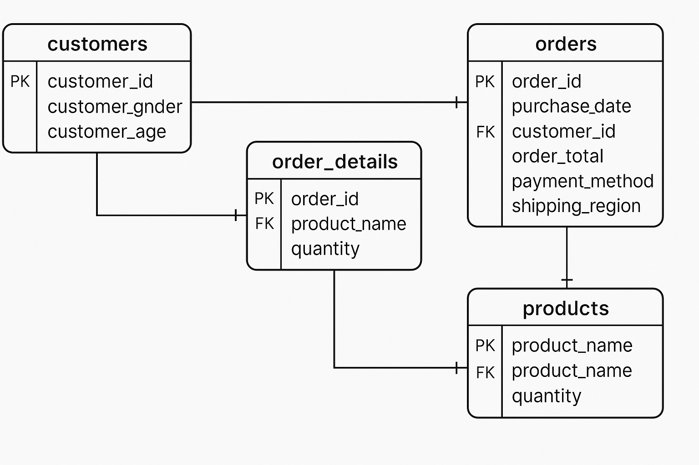

#  Práctica LABORATORIO SISTEMAS ORGANIZACIONALES Y GERENCIALES 2 Sección N

## Objetivo
Que el estudiante comprenda la importancia del análisis de datos dentro de una
organización, reconociendo cómo los Insights derivados del análisis pueden
informar la toma de decisiones estratégicas, mejorar la eficiencia operativa y
aumentar la ventaja competitiva en el mercado.

## Planificación:

### Pablo (Tareas 1-4)

- Preparación de datos: Extracción, limpieza y carga en la base de datos SQL en la nube.
- Análisis exploratorio: Obtención de datos, estadísticas básicas y visualización de ventas por categoría y región.
- Análisis de tendencias: Identificación de los meses con mayores y menores ventas, así como los productos más vendidos y menos populares.
- Segmentación de clientes: Agrupación por edad y comparación de comportamiento de compra entre géneros.

### Yonathan (Tareas 5-8)
- Análisis de correlación: Relaciones entre edad del cliente y total de orden, así como métodos de pago por categoría.
- Visualización de datos: Creación de gráficos para representar hallazgos clave.
- Conclusiones y recomendaciones: Elaboración de insights clave y acciones de mejora.
- Respuestas a preguntas estratégicas sobre diferenciación, decisiones, ahorro de costos y datos adicionales a recopilar.

## Herramientas y Tecnologías Utilizadas
El equipo utilizó las siguientes herramientas para facilitar el desarrollo del proyecto:

- Visual Studio Code: Para escribir y ejecutar scripts en Python.
- Python: Para manipulación de datos, análisis y visualización.
- Jupyter Notebook: Para análisis exploratorio y visualización de datos.
- MySQL Workbench: Para gestionar la base de datos y realizar consultas SQL.
- Amazon RDS: Para almacenamiento y procesamiento de datos en la nube.
Canva: Para la presentación visual del informe final.

### Establecimiento de Plazos
El proyecto se trabajó en un período de cuatro días, del domingo 16 de marzo al miércoles 19 de marzo, organizando el trabajo en fases:

- Día 1 (16 de marzo): Creación de la base de datos, limpieza del archivo CSV y carga en SQL.
- Día 2 (17 de marzo): Análisis exploratorio, tendencias de ventas y segmentación de clientes.
- Día 3 (18 de marzo): Análisis de correlación y generación de visualizaciones.
- Día 4 (19 de marzo): Conclusiones, recomendaciones y respuestas a preguntas estratégicas.


# Proceso de análisis:

#  Limpieza y Preparación de Datos

##  Enfoque Paso a Paso para la Limpieza y Preparación de Datos  

### 1️ Carga del Dataset en Pandas  
- Se utilizó `pandas.read_sql()` para obtener los datos directamente desde MySQL.  
- Se verificó la correcta carga de los datos con `.head()` y `.info()`.  

### 2️ Manejo de Valores Faltantes  
- Se revisó la presencia de valores nulos con `.isnull().sum()`.  
- Se decidió:  
   **Eliminar registros nulos** en columnas críticas como `order_id`, `purchase_date`, y `product_name`.  
   **Rellenar valores nulos** en `customer_age` con la media.  

### 3️ Eliminación de Duplicados  
- Se verificaron duplicados con `.duplicated().sum()`.  
- Se eliminaron registros duplicados con `.drop_duplicates()`.  

### 4️ Conversión de Tipos de Datos  
- Se revisaron los tipos de datos con `.dtypes`.  
- Se convirtió `purchase_date` a `datetime64` con:  
  ```python
  df['purchase_date'] = pd.to_datetime(df['purchase_date'], format="%Y-%m-%d")

# Detalle los desafíos encontrados durante el análisis y cómo los

- Al momento de la conexión de la base de datos con AWS se presentó un error de permisos de seguridad por parte de AWS, el cual se supero revisando y creando grupos de seguridad desde AWS para establecer permisos para la conexión local de la base de datos.

- Un desafío fue realizar el analisis concreto de las estadisticas generadas pero se llevó a cabo en conjunto con los dos integrantes del grupo solicionando dudas uno al otro.


# Metodología:

##  Criterios para Seleccionar los Gráficos  
Para elegir las visualizaciones más adecuadas, consideramos:  
 **Tipo de datos** (numéricos, categóricos, fechas).  
 **Facilidad de interpretación** (claridad en la presentación de la información).  
 **Relevancia** para el análisis de ventas y tendencias.  

##  Visualizaciones Utilizadas  

### 1️ Gráfico de Barras – Ventas por Categoría de Producto  
 Razón:  
- Los productos se agrupan en **categorías** (categórico).  
- Queríamos comparar el número de ventas por categoría.  
- Se utilizó `seaborn.countplot()` para visualizar la cantidad de órdenes en cada categoría.  

## Implementación:  
```python
plt.figure(figsize=(10, 5))
sns.countplot(y=df['product_category'], order=df['product_category'].value_counts().index, palette="coolwarm")
plt.title("📊 Distribución de Ventas por Categoría de Producto")
plt.xlabel("Cantidad de Ventas")
plt.ylabel("Categoría de Producto")
plt.show()
```

# Diagrama utilizado para la base de datos 
