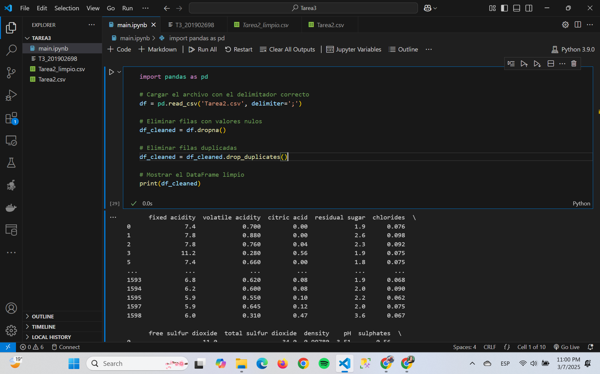
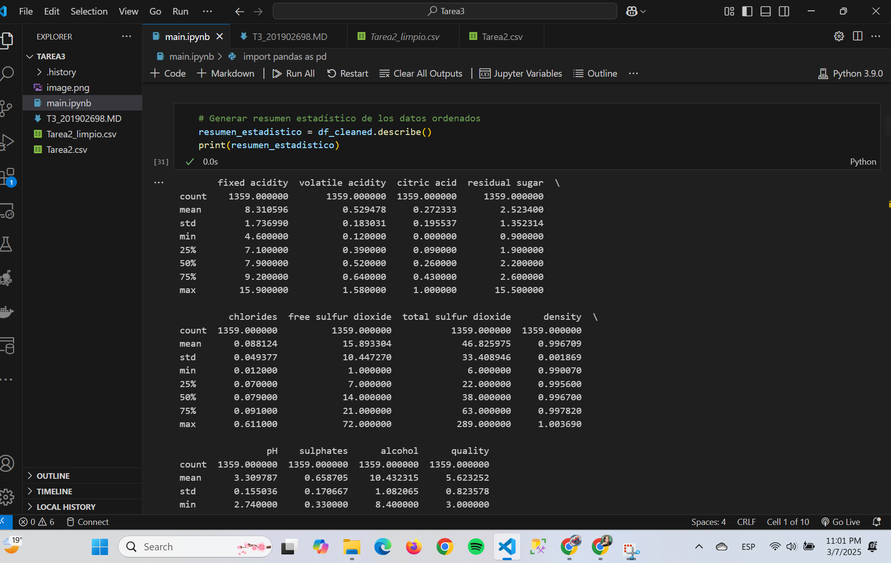
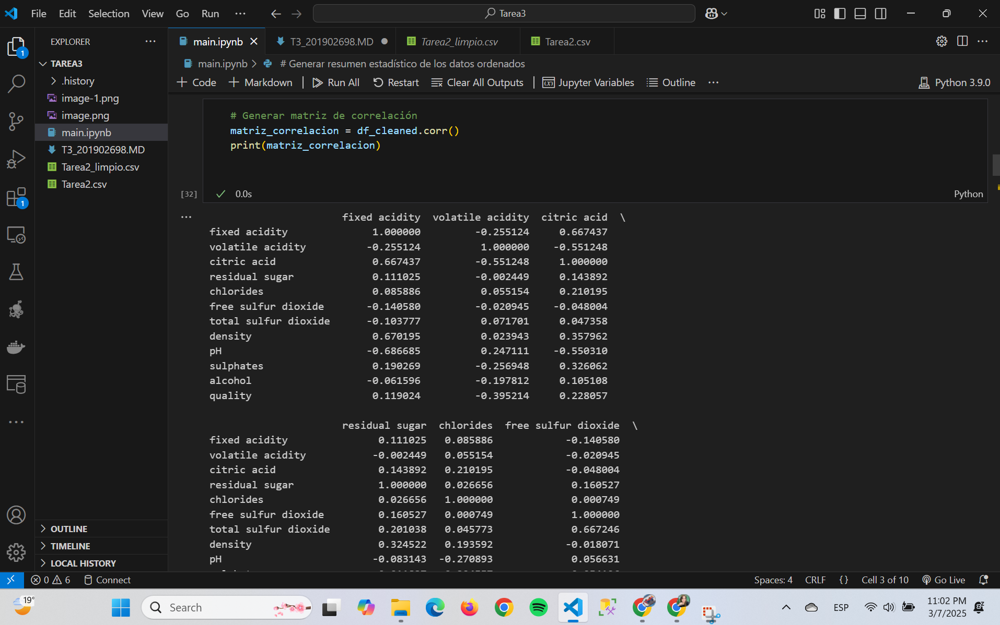
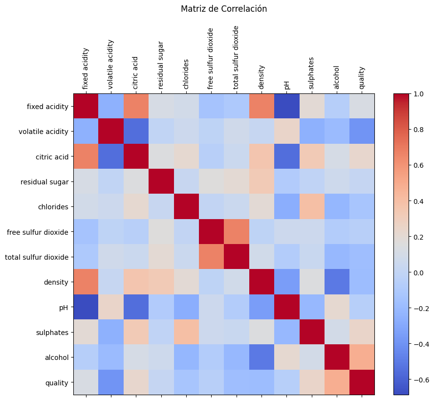
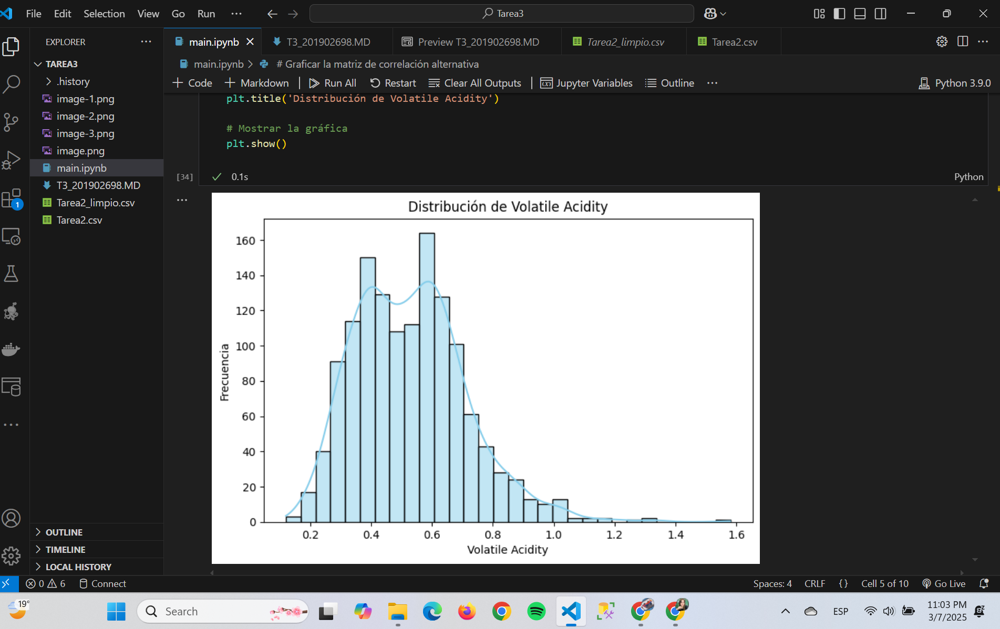
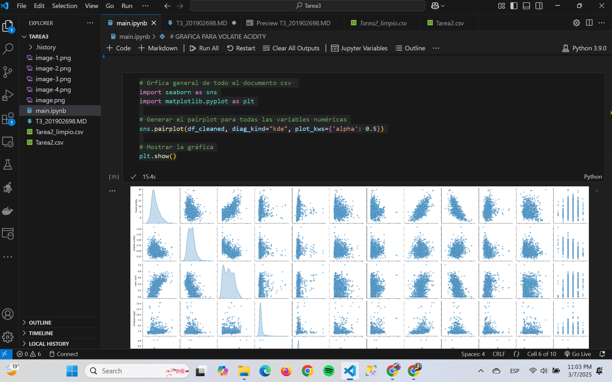
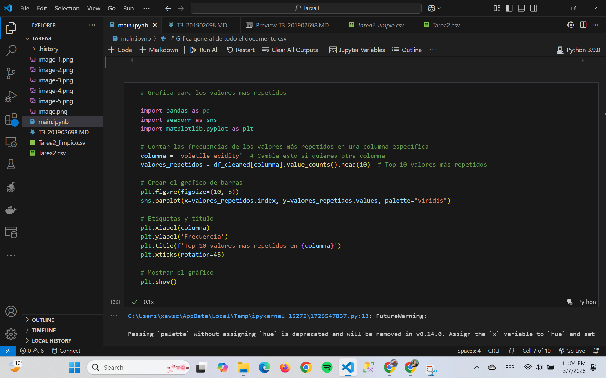
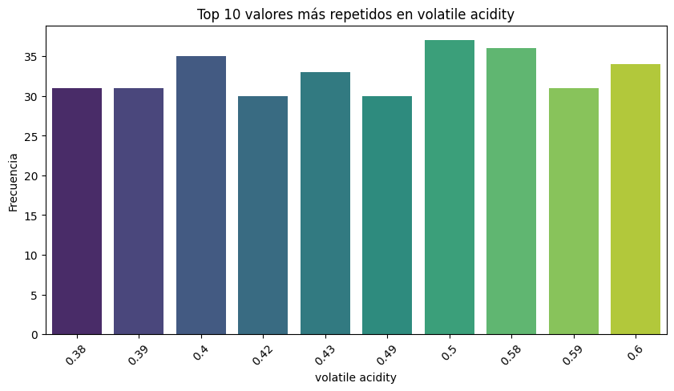
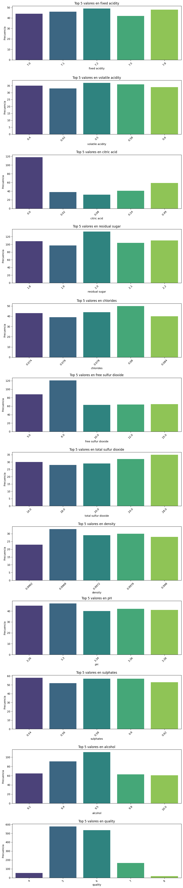

# Tarea 3
## Pablo Javier Batz Contreras - 201902698

- Limpieza de datos  

- Resumen de datos ordenados 

- Matriz de correlacion 

- Analisis Distribución de Volatile Acidity
- 

- Grafico general para el archivo CSV. 

- Grafico de valores repetidos 

- Top 5 de valores mas repetidos 
- 

# Conclusiones.

## 1. Calidad de los Datos  
Después de eliminar valores nulos y duplicados, los datos están más limpios y confiables para el análisis. Sin embargo, si se eliminaron muchas filas, podría indicar problemas de calidad en la recolección de datos.  

## 2. Relación entre Variables  
El heatmap de correlación mostró qué variables tienen mayor relación entre sí. Por ejemplo:  
- Si "volatile acidity" tiene una correlación negativa con la calidad, significa que **valores altos de acidez volátil pueden afectar negativamente la calidad del producto.  
- Otras variables con correlaciones fuertes pueden indicar factores clave que influyen en el resultado.  

## 3. Tendencias y Valores Más Frecuentes  
El análisis de los valores más repetidos en cada columna nos ayuda a identificar tendencias. Por ejemplo:  
- Si ciertos niveles de acidez, pH o alcohol son los más comunes, esto puede indicar un estándar de producción o una tendencia en los datos.  
- Si hay valores que dominan demasiado una columna, puede ser necesario investigar si el dataset está desbalanceado. 